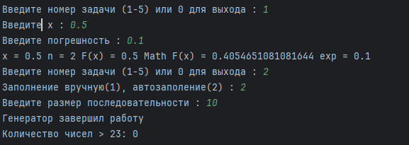
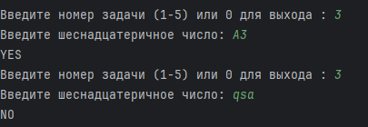
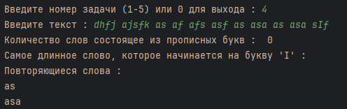
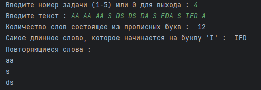

#Programm have 5 main functions.
#1)Calculate ln(x+1).
#2)A loop that takes integers and finds the number of numbers greater than 23.
#3)Determine if a string entered from the keyboard is a hexadecimal number.
#4)a) determine the number of words consisting of capital letters;
  #b) find the longest word that begins with the letter 'I';
  #c) print the repeated words
#5)In a list of integer elements, calculate the number of odd negative elements and the sum of the elements of the list located before the last element equal to zero.
#LabWork number 3
#Horoshko Kirill
#15.04.2025

from math import *

def input_float(prompt):
    """
    Запрашивает у пользователя число с проверкой корректности ввода.

    Args:
        prompt (str): Подсказка для ввода.

    Returns:
        float: Введённое пользователем число.
    """
    while True:
        try:
            return float(input(prompt))
        except ValueError:
            print("Ошибка: введите число!")

def input_int(prompt):
    """
    Запрашивает у пользователя число с проверкой корректности ввода.

    Args:
        prompt (str): Подсказка для ввода.

    Returns:
        int: Введённое пользователем число.
    """
    while True:
        try:
            return int(input(prompt))
        except ValueError:
            print("Ошибка: введите число!")

def calculate_seq(n, buf):
    """
    Генератор который вычисляет каждый член ряда

    Args:
        n (int): Номер итерации
        buf (float): Значение шага итерации

    Retruns:
        int: Номер итерации
        float: Вычисленное n-е значение ряда
    """

    while True:
        if n == 1:
            n += 1
            yield (n, buf)
        else:
            buf = buf*buf * (n - 1) / n * (-1)
            n += 1
            yield (n, buf)

def task1():
    """
    Функция выполняющая задание 1
    """
    x = 0

    while True:
        try:
            x = input_float("Введите x : ")
            if (abs(x) < 1):
                break
            else:
                raise(ValueError)
        except ValueError:
            print("Ошибка: введите число мпо модулю меньше 1")

    n = 1
    total = 0
    buf = x

    exp = input_float("Введите погрешность : ")

    while n < 500 and abs(log(1+x)-total) > exp:
        (n, buf) = next(calculate_seq(n, buf))
        total += buf

    print(f"x = {x} n = {n} F(x) = {total} Math F(x) = {log(1+x)} exp = {exp}")

def num_gen(n):

    """
    Генератор последовательности чисел от n до 1

    Args:
        n(int) : Размер последовательности

    Returns :
        int: Элемент последовательности

    """
    num = n
    while num > 1 :
        yield(num)
        num -= 1

def count_23(func):

    """
    Декоратор для задания 2
    """

    def in_count():
        count = 0
        while True:
            num = func()
            if num == 15:
                break
            if num > 23:
                count += 1
        print(f"Количество чисел > 23: {count}")
    return in_count

@count_23
def input_number():
    while True:
        try:
            return int(input("Введите целое число (15 для выхода): "))
        except ValueError:
            print("Ошибка: введите целое число!")

def use_generator(n):
    """
    Функция для использования генератора num_gen

    Args:
        n (int): Верхняя граница последовательности

    Returns:
        int : Количество чисел больших 23
    """
    generator = num_gen(n)
    count = 0
    try:
        while True:
            value = next(generator)
            if value > 23 :
                count += 1
    except StopIteration:
        print("Генератор завершил работу")

    return count

def task2():
    """
    Функция выполняющая задание 1

    """
    case = 0

    while True:
        try:
            case = input_int("Заполнение вручную(1), автозаполение(2) : ")
            if (case == 1) or (case == 2):
                break
            else:
                raise (ValueError)
        except ValueError:
            print("Ошибка: введите число 1 или число 2")

    if (case == 2):
        n = input_int("Введите размер последовательности : ")
        print(f"Количество чисел > 23: {use_generator(n)}")
    else:
        input_number()

def task3():
    """
        Функция выполняющая задание 3

    """

    s = input("Введите шеснадцатеричное число: ")

    flag = True

    for c in s:
        if (not(c >= '0' and c <= '9' or c >= 'A' and c <= 'F')):
            flag = False
            break

    if flag:
        print("YES")
    else:
        print("NO")

def task4():
    """
        Функция выполняющая задание 4

    """

    text = input("Введите текст : ")

    words = [word.strip(".,!?;:-'\"") for word in text.split()]

    count = 0
    max_word_I = ''

    for word in words:
        if word.isupper():
            count += 1
        if (word[0] == 'I' and len(word) > len(max_word_I)):
            max_word_I = word

    print('Количество слов состоящее из прописных букв : ', count)
    print("Самое длинное слово, которое начинается на букву 'I' : ", max_word_I)

    word_counts = {}
    for word in words:
        lower_word = word.lower()
        word_counts[lower_word] = word_counts.get(lower_word, 0) + 1

    print("Повторяющиеся слова : ")

    for word in word_counts:
        if word_counts[word] > 1:
            print(word)

def task5():
    """
        Функция выполняющая задание 4

    """

    l = []

    buf = 1

    while buf != 0:
        buf = input_int("Введите элемент списка : ")
        l.append(buf)

    count = 0
    sum = 0

    for i in l:
        if i % 2 == 1 and i < 0:
            count += 1
        sum += i

    print(f"Количество нечетных отрицательных элементов {count}")
    print(f"Сумма всех элементов массива {sum}")

def main():

    n = 1

    while n != 0:

        while True:
            try:
                n = input_int("Введите номер задачи (1-5) или 0 для выхода : ")
                if n < 0 or n > 5:
                    raise ValueError
                else:
                    break
            except ValueError:
                print("Ошибка: введите число!")

        if n == 1:
            task1()
        elif n == 2:
            task2()
        elif n == 3:
            task3()
        elif n == 4:
            task4()
        elif n == 5:
            task5()

main()

